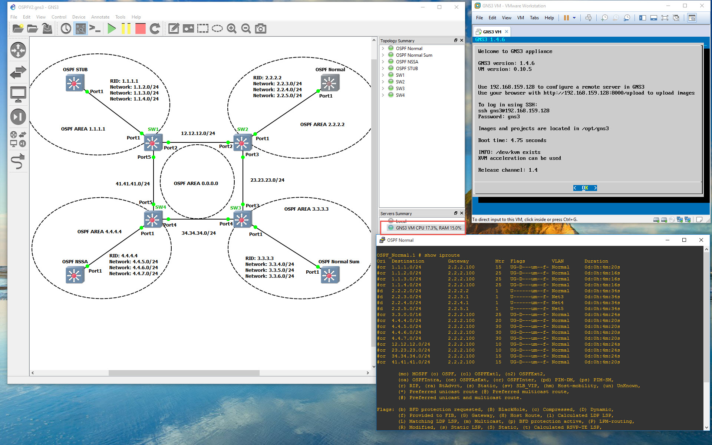

# Setting up GNS3 with EXOS-VM
This Guide will assist you in setting up GNS3 V2 and above to work with EXOS-VM in Windows.  If you have any questions about this guide please open a [Issue](https://github.com/extremenetworks/Virtual_EXOS/issues/new) on GitHub or on  [The HUB](http://community.extremenetworks.com/).

If you are setting this up in macOS, see the [macOS GNS3 EXOS VM Guide](GNS3_EXOS-VM_Guide_macOS.md)  

**Note: EXOS-VMs can get stuck in (pending AAA) for 1-2 minutes.  Just be patient it will finish, and allow you to login**.

### What you will need: -- See "Getting Started" section below for step by step instructions.
* VMware Player - latest version  --  This is needed for the GNS3-VM
 	* https://www.vmware.com/products/player
 	
* VMware VIX API - latest version -- You need this so GNS3 can control VMware Player
	* 	* https://www.vmware.com/support/developer/vix-api/
	
* GNS3-VM.ova from GitHub  --  This version must match the version of GNS3 on your local machine
 	* GNS3.VM.VMware.Workstation.X.X.X.zip
 		*  https://github.com/GNS3/gns3-gui/releases

* GNS3 for your local machine.  -- This version must match the version of GNS3-VM
 	*  GNS3-X.X.X-all-in-one.exe
 		*  https://www.gns3.com/software/download or https://github.com/GNS3/gns3-gui/releases

* GNS3 Template File for EXOS VM  -- This is used to import EXOS into GNS3
	* exosvm.gns3a
		* https://github.com/extremenetworks/Virtual_EXOS/blob/master/exosvm.gns3a?raw=true

------
### Getting Started:

#### Step 1: Download GNS3 Template File
* Download GNS3 Template File for EXOS VM.  --  You will need this in Step 8  
	* https://github.com/extremenetworks/Virtual_EXOS/blob/master/exosvm.gns3a?raw=true  *"right-click save link as"*

#### Step 2: VMware Player

* Download and install [VMware Player](https://www.vmware.com/products/player). 

#### Step 3: VMware VIX API
Note: This step is not required if using Vmware Workstation

* Download and install [VMware VIX API](https://www.vmware.com/support/developer/vix-api/)

#### Step 4: GNS3-VM.ova
1.  Download [GNS3.VM.VMware.Workstation.X.X.X.zip](https://github.com/GNS3/gns3-gui/releases) from GitHub  -- This version must match the version of GNS3 program on your local machine
2.  Import the GNS3-VM.ova into Vmware player.  **Don't start it yet.**
3.  Edit the VM to make sure you give it as much memory and CPUs as you can.  This will help improve your experience when using GNS3 and EXOS-VM.  I recommend giving the VM all CPUs and half of your RAM.
4.  Reboot your PC to make sure VMware VIX and  Vmware player are installed fully.
5. Boot up VM and note the IP it gets.  Keep the VM up

**Note: Some PCs require virtualization to be enabled in the BIOS.  Make sure you have this enabled or you will have issues on Step 7, but VMware will tell you.**

#### Step 5: GNS3 for your local machine
* Download [GNS3-X.X.X-all-in-one.exe](https://www.gns3.com/software/download) and install GNS3 program for your local machine.  -- This version must match the version of GNS3-VM

#### Step 6: Open GNS3
1. Make sure GNS3-VM is booted
2. Open GNS3

#### Step 7: Setting up GNS3
1. A Setup Wizard should show up when you open GNS3.  Select "Run modern IOS" and click next.  
2. Change the host binding to 127.0.0.1.
3. The connection should be successful.  Click Next
4. Click on "VMware" -> Select your GNS3-VM -> and select the same CPUs and RAM you picked in Step 4.3. -> Click Next
5. Click finish
6. Move to step 8, or click on "Import an appliance" and open the exosvm.gns3a file downloaded in Step 1.

#### Step 8: Import EXOS-VM as Appliance 
1. Go to File -> Import appliance -> Open the exosvm.gns3a file downloaded in Step 1.
2. Click next -> Select "Run the appliance on the GNS3-VM" -> Click next.
3. You should see two versions of EXOS.  Expand the version you want and click on the file. -> click download.
4. Once downloaded Click on import, and select the file you just downloaded. -> Click Next -> Click Yes -> Click Next -> Click Finish -> Click OK.
5. Now you will see a router that is called "EXOS VM XX.X.X.X" in your inventory.
6. Drag the VM to your project. and select yes to upload your image to your VM.

### Step 9: Have fun!
1. Move more switches over connect them together, boot them up, and configure them.  Be careful for loops!

### Screenshot

