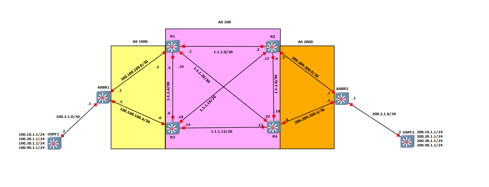

# BGP & Route Redistribution To And From OSPF

This GNS3 project was made to show a configuration example of BGP with route redistribution.  There are three separate BGP AS'es, and two OSPF AS'es.

*Note: These projects were built for the EXOS-VM_v32.7.2.19.qcow2 image. Make verify the image is loaded into GNS3 before you import the project.*

* [GNS3 32.7 Project file](https://github.com/stewilliams-extr/Virtual_EXOS/raw/refs/heads/master/gns3_projects/BGP/BGP_32.7.2.gns3project)

* [Configuration Files and Routing Tables](Configurations)
  

* [How To: Troubleshoot BGP Issues on Switch Engine (EXOS)](https://extreme-networks.my.site.com/ExtrArticleDetail?an=000078327)
* [How To: Configure BGP on Switch Engine (EXOS)](https://extreme-networks.my.site.com/ExtrArticleDetail?an=000122408)
>Note: ECMP is not supported in EXOS-VM. This is because ECMP requires hardware support, and the required hardware is not emulated in the VM.
