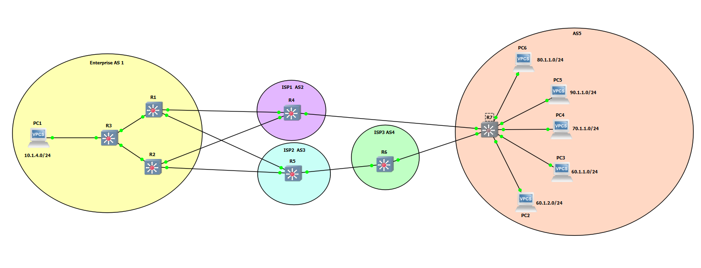

# BGP Outbound Traffic Engineering.

This GNS3 project aims to demonstrate on how you could perform outbound Traffic engineering with BGP.

Note: These projects were built for the EXOS-VM_v32.6.3.126-disk1.qcow2.  Make sure the image is loaded into GNS3 before you import the project.

