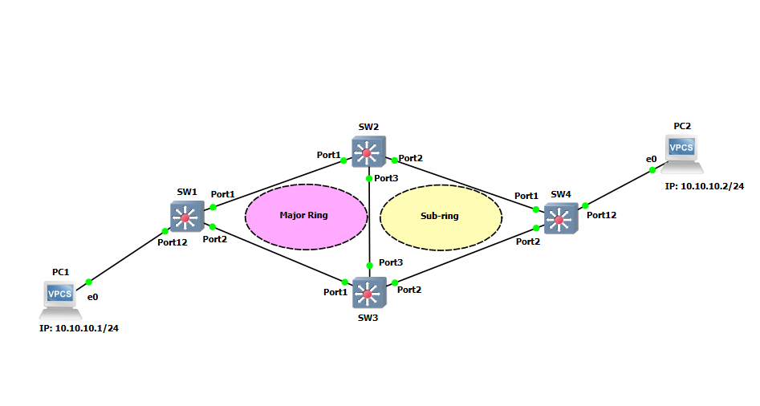

# ERPS With Major And Subring Rings 

This GNS3 project was made to show a configuration example of how ERPS is configured in EXOS with both a major ring and a subring (ITU-T G.8032v2).

*Note: These projects were built for the EXOS-VM_v32.7.2.19.qcow2 image. Make verify the image is loaded into GNS3 before you import the project.*

* [GNS3 32.7.2.19 Project file](https://github.com/stewilliams-extr/Virtual_EXOS/blob/master/gns3_projects/erps_subring/erps_subring.zip)
* [Configuration Files](Configurations)

## Relevant Articles
* [How To: Configure an EAPS Ring on Switch Engine (EXOS)](https://extreme-networks.my.site.com/ExtrArticleDetail?an=000080836)
* [How to Troubleshoot EAPS Segment Timer Fail Flag Messages on Switch Engine (EXOS)](https://extreme-networks.my.site.com/ExtrArticleDetail?an=000081383)
