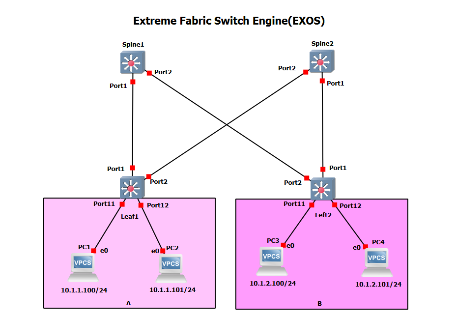

# ExtremeFabric GNS3 project

This is an example of a small ExtremeFabric network

Note: These projects were built for the EXOS-VM_v22.2.1.5-disk1.qcow2 image.  Make sure the image is loaded into GNS3 before you import the project.

* [GNS3 22.2 Project file](https://github.com/extremenetworks/Virtual_EXOS/blob/master/gns3_projects/ExtremeFabric/extreme_fabric.gns3project?raw=true)
* [Configuration Files](configs)

Note that as of EXOS 22.2, ExtremeFabric is beta and should not be used in production networks. Further information on ExtremeFabric can be found in the [ExtremeFabric Release Notes](http://documentation.extremenetworks.com/release_notes/ExtremeXOS/ExtremeFabric/ExtremeFabric_EXOS_22.2_RelNotes.pdf)
