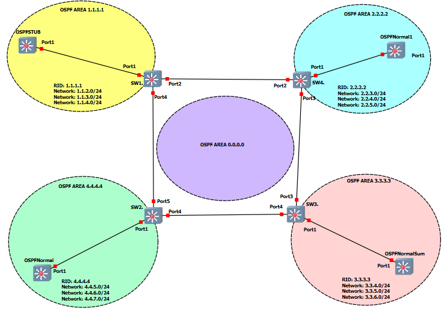

# OSPF Area example GNS3 project

This GNS3 project was made to show a configuration example of how different OSPF area types are configured.  In the picture below you can see that each area shows a example of a different way to use a OSPF area.

*Note: These projects were built for the EXOS-VM_v32.7.2.19.qcow2 image. Make verify the image is loaded into GNS3 before you import the project.*

* [GNS3 32.7.2.19 Project file](https://github.com/stewilliams-extr/Virtual_EXOS/blob/master/gns3_projects/OSPF_areas/OSPFv2.zip)

>Note: in this example /24 networks are used as P2P links.  You would normaly use /30 for P2P links.  I wanted to make the last Octet of the IP to reflect the Switch #.

## Relevant Articles
* [How To: Troubleshoot BGP Issues on Switch Engine (EXOS)](https://extreme-networks.my.site.com/ExtrArticleDetail?an=000078327)
* [How To: Configure BGP on Switch Engine (EXOS)](https://extreme-networks.my.site.com/ExtrArticleDetail?an=000122408)
