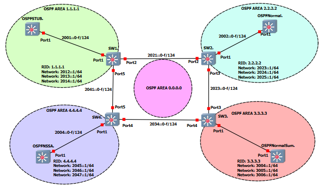

# OSPFv3 Area Example Project

This GNS3 project was made to show a configuration example of how different OSPFv3 area types are configured using IPv6.  In the picture below you can see that each area shows a example of a different way to use a OSPF area.

*Note: These projects were built for the EXOS-VM_v32.7.2.19.qcow2 image. Make verify the image is loaded into GNS3 before you import the project.*

* [GNS3 32.7 Project file](https://github.com/stewilliams-extr/Virtual_EXOS/raw/refs/heads/master/gns3_projects/OSPFv3_AREA/ospfv3.gns3project)
* [Configuration Files and Routing Tables](configurations)

## Relevant Article
* [Extreme OSPFv3 User Guide](https://documentation.extremenetworks.com/switchengine_32.7.1/downloads/SwitchEngine_User_Guide_32.7.1.pdf) page 1651
