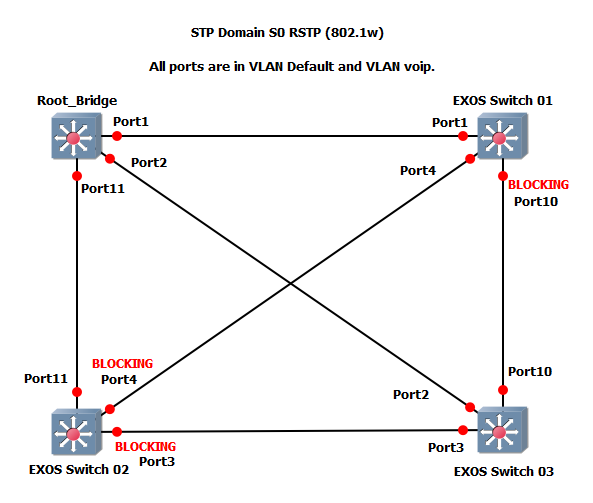

# RSTP (802.1w) Example Project

This GNS3 project was made to show a configuration example of how RSTP is configured.  In this lab there are two VLANs.  One is the Default VLAN and the other is VOIP.  the VOIP VLAN is using auto-bind.

*Note: These projects were built for the EXOS-VM_v32.7.2.19.qcow2 image. Make verify the image is loaded into GNS3 before you import the project.*

* [GNS3 32.7 Project file](https://github.com/stewilliams-extr/Virtual_EXOS/raw/refs/heads/master/gns3_projects/RSTP_LAB/RSTP_LAB_32.7.gns3project)
* [Configuration Files](configurations)

  

  
## Relevant Article
* [How To: Configure RSTP in Switch Engine (EXOS)](https://extreme-networks.my.site.com/ExtrArticleDetail?an=000078327) 

