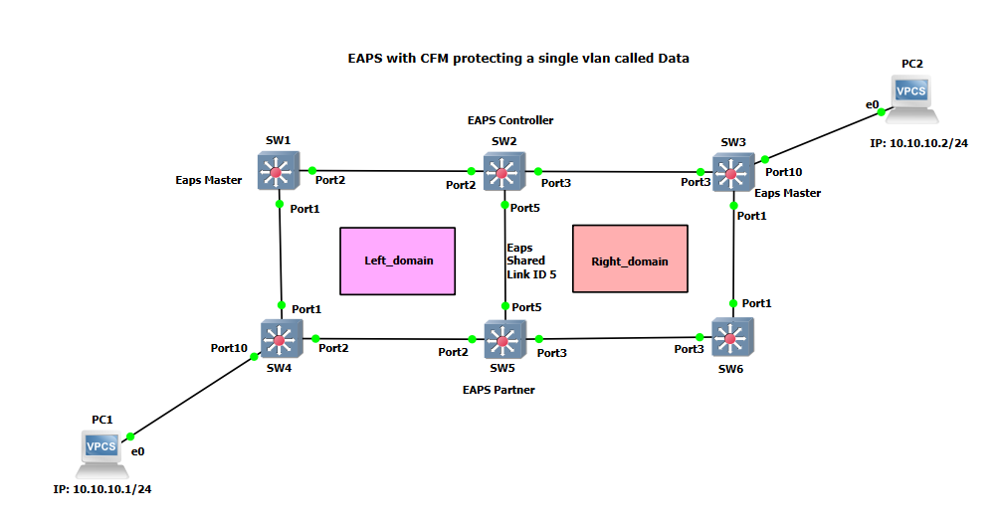

# Two EAPS Ring example GNS3 project

This GNS3 project was made to show a configuration example of how Two EAPS rings connected together with CFM is configured.  Vlan Data is across all switches and CFM is used with EAPS to protect against logical failures.

Note: These projects were built for the EXOS-VM_v21.1.1.4-disk1.qcow2 and the EXOS-VM_v22.1.1.5-disk1.qcow2 images.  Make sure the image is loaded into GNS3 before you import the project.

* [GNS3 21.1 Project file](https://github.com/extremenetworks/Virtual_EXOS/blob/master/gns3_projects/Two_EAPS_rings/EAPS_2ring_CFM.gns3project?raw=true)
* [GNS3 22.1 Project file](https://github.com/extremenetworks/Virtual_EXOS/blob/master/gns3_projects/Two_EAPS_rings/EAPS_2ring_CFM_v22.1.gns3project?raw=true)
* [Configuration Files](configurations)

