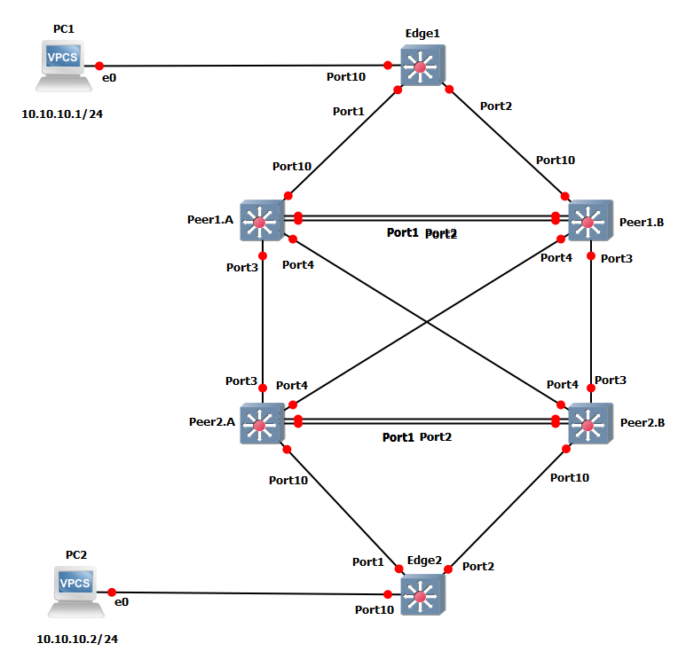

# Two Tier MLAG Example Project

This GNS3 project was made to show a configuration example of how Two tier MLAG is configured.  Vlan Data is across all switches.

*Note: These projects were built for the EXOS-VM_v32.7.2.19.qcow2 image. Make verify the image is loaded into GNS3 before you import the project.* 

* [GNS3 32.7 Project file](https://github.com/stewilliams-extr/Virtual_EXOS/raw/refs/heads/master/gns3_projects/Two_Trier_MLAG/MLAG.gns3project)
* [Configuration Files](configurations)

>Note: The MLAG failover may take up to 10 sec becasue of limitations with GNS3 and qemu devices.  LLDP was used to allow failover to happen.

## Relevant Articles
* [How To: Configure MLAG on Switch Engine (EXOS)](https://extreme-networks.my.site.com/ExtrArticleDetail?an=000079895)
* [How To: Configure Two-Tier MLAG on Switch Engine (EXOS)](https://extreme-networks.my.site.com/ExtrArticleDetail?an=000082635)
