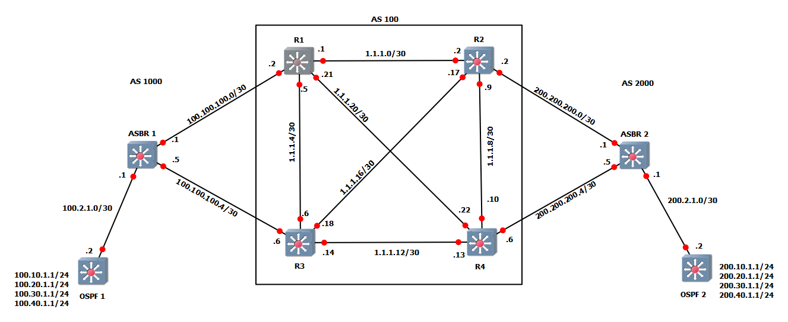

# BGP with route redistribution to and from OSPF

This GNS3 project was made to show a configuration example of BGP.  There are three separate BGP ASes, and two OSPF ASes.

Note: These projects were built for the EXOS-VM_v21.1.1.4-disk1.qcow2 and the EXOS-VM_v22.1.1.5-disk1.qcow2 images.  Make sure the image is loaded into GNS3 before you import the project.

* [GNS3 21.1 Project file](https://github.com/extremenetworks/Virtual_EXOS/blob/master/gns3_projects/bgp/bgp.gns3project?raw=true)
* [GNS3 22.1 Project file](https://github.com/extremenetworks/Virtual_EXOS/blob/master/gns3_projects/bgp/BGP_v22.1.gns3project?raw=true)
* [Configuration Files and Routing Tables](configs)

>Note: ECMP is not supported in EXOS-VM. This is because ECMP requires hardware support, and the required hardware is not emulated in the VM.
