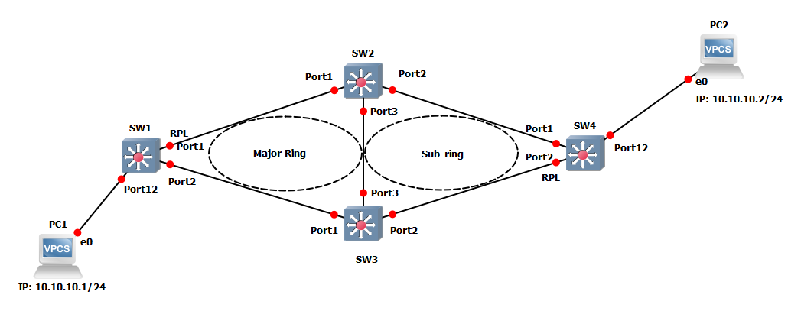

# ERPS with major ring and subring

This GNS3 project was made to show a configuration example of how ERPS is configured in EXOS with both a major ring and a subring (ITU-T G.8032v2).

Note: These projects were built for the EXOS-VM_v21.1.1.4-disk1.qcow2 and the EXOS-VM_v22.1.1.5-disk1.qcow2 images.  Make sure the image is loaded into GNS3 before you import the project.

* [GNS3 21.1 Project file](https://github.com/extremenetworks/Virtual_EXOS/blob/master/gns3_projects/erps_subring/erps_subring.gns3project?raw=true)
* [GNS3 22.1 Project file](https://github.com/extremenetworks/Virtual_EXOS/blob/master/gns3_projects/erps_subring/erps_subring_22.1.gns3project?raw=true)
* [Configuration Files](configs)

Note: due to a bug in EXOS-VM, R-APS packets are not forwarded correctly. Due to this, ERPS rings with >3 nodes will not work properly. Any nodes not connected directly to the RPL owner will be stuck in "Pending" state.
