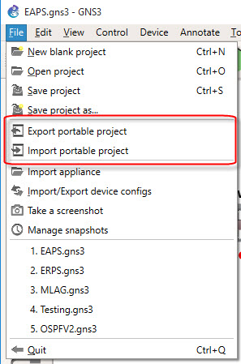

# Importing and Exporting individual GNS3 projects on GNS3-VM 1.5.2 and above.

GNS3 V1.5.2 has made it very easy to import and export GNS3 project.

## Exporting individual projects:

##### Step 1:
Open the project

##### Step 2:
Click file, and then Export

##### Step 3:
You’ll be prompted to choose whether to include the base image—the .qcow2 EXOS VM image—when backing up your project.

   If you select “Yes”, a 117MB image will be included for each switch in your project. This can significantly increase the size of your backup.

  If you select “No”, the backup will include everything except the base images. This includes:

   Switch configurations (also known as QEMU snapshots)

   Network topology and connections

Choose based on whether you need a fully self-contained backup or a lighter one that assumes access to the base images separately.

## Importing individual projects:

##### Step 1:
Open GNS3

##### Step 2:
Click file, and then Import

##### Step 3:
Select your project and click open.

> Note: If the project uses a specific .qcow2 EXOS image you will need to have the Device/version added into GNS3 Devices section.  See [GNS3 with EXOS-VM install Guide](https://github.com/extremenetworks/Virtual_EXOS/blob/master/GNS3_EXOS-VM_Guide.md) for steps.

##### Step 3:
Start your switches and Enjoy!

> Backup files are just .zip files and can be extracted to see contents. 
