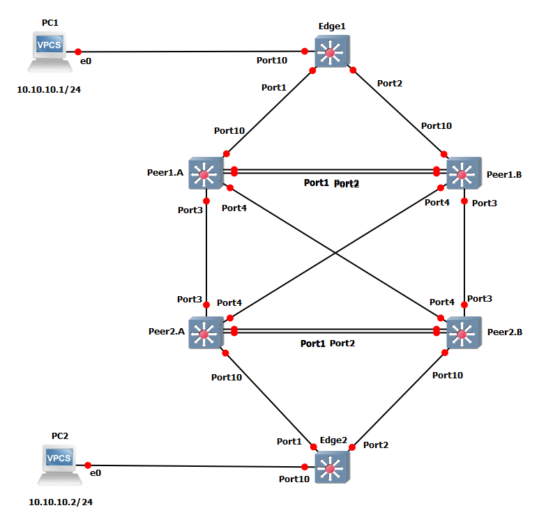

# Two tier MLAG example GNS3 project

This GNS3 project was made to show a configuration example of how Two tier MLAG is configured.  Vlan Data is across all switches.

>Note: The MLAG failover may take up to 2-3 minutes becasue of limitations with GNS3 and qemu devices.  LLDP was used to allow failover to happen.

[Project ZIP file](MLAG.zip)
[Configuration Files}(configurations)
